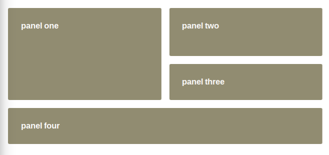
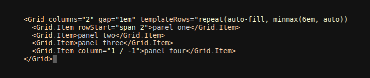

Experiments in wrapping [css grid layout] using React components.

Grid is tricky to abstract into components. In many ways, it's ideal for use in
CSS: being able to refer to individual grid regions by name and to vary designs
based on media queries are useful techniques that don't really come through with
a component-oriented approach. Additionally, the restraint that grid display
can only affect immediate child components means the nested-layout patterns
that are so common in React codebases need to be re-thought.

To this end, I hope this repo can explore some ways of translating the great
parts of `display: grid` to a component model. I imagine at the very least,
components can be the interface for grid wrapper and grid item properties. On
top of that layer, richer abstractions can be made.

[css grid layout]: https://developer.mozilla.org/en-US/docs/Web/CSS/CSS_Grid_Layout
